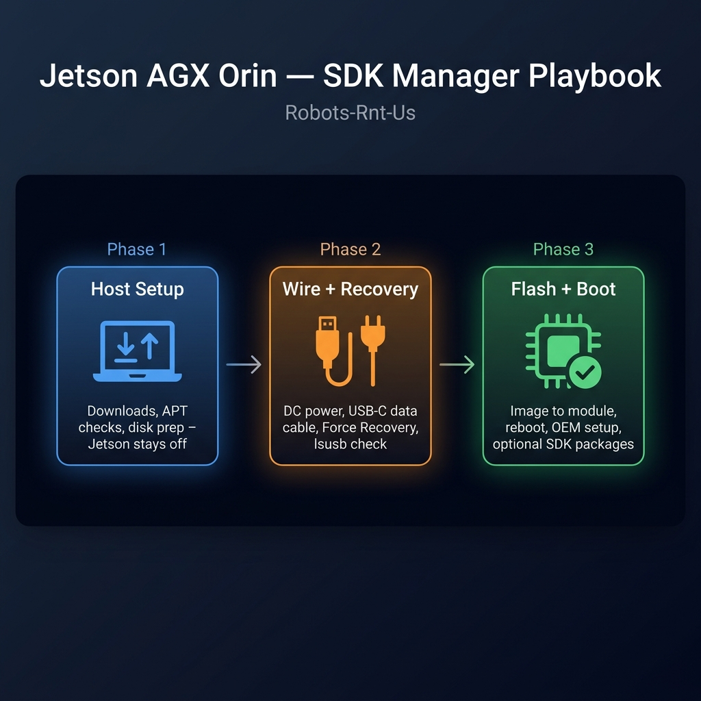

# Jetson flash playbook — Robots-Rnt-Us lab



Operational docs for **Jetson AGX Orin Developer Kit** + **Ubuntu 22.04 x86_64 flashing PC** using **JetPack 6.x** and **SDK Manager**.

> **📖 [Open the playbook wiki →](https://github.com/Robots-Rnt-Us/jetson-flash-playbook/wiki)** for a quick-skim landing page and printable bench flyer.

---

## New here? Start in one place

1. Open **[docs/START_HERE.md](docs/START_HERE.md)** — phased timeline, checklist, wiring notes, NVMe reminder, Wi‑Fi/Chromium/SSH snippets, embedded **flowchart**.
2. Keep **[docs/jetson/troubleshooting.md](docs/jetson/troubleshooting.md)** nearby when something breaks.
3. Read **[docs/jetson/bring-up-journey.md](docs/jetson/bring-up-journey.md)** if you need reassurance that messy sessions are ordinary.

---

## Using this repo with AI assistants / LLMs

This playbook is deliberately written so assistants can treat it like **indexed ground truth** before improvising unreliable Jetson steps.

- Repo-level agent policy: **[`AGENTS.md`](AGENTS.md)** (read order + safety rails).
- Human wiring guide (Cursor, uploads, RAG): **[`docs/meta/agent-and-llm-usage.md`](docs/meta/agent-and-llm-usage.md)**.

Open the Markdown files in **this clone** alongside your IDE chat—or attach/upload them to hosted bots—so guidance stays anchored to validated lab procedures rather than miscellaneous web search results.

---

## Repo map

| Doc | Audience |
|-----|----------|
| [`AGENTS.md`](AGENTS.md) | LLM/agent policy: citation order before guessing Jetson/SDK Manager flows |
| [docs/meta/agent-and-llm-usage.md](docs/meta/agent-and-llm-usage.md) | Humans connecting Cursor/Chats/RAG setups to grounded Markdown |
| [docs/START_HERE.md](docs/START_HERE.md) | First-time flashes; wants order-of-operations clarity |
| [docs/jetson/flash-runbook.md](docs/jetson/flash-runbook.md) | Exhaustive scripted CLI / UI choices |
| [docs/jetson/troubleshooting.md](docs/jetson/troubleshooting.md) | Error symbology ⇢ mitigations matrix |
| [docs/jetson/faq.md](docs/jetson/faq.md) | Instant answers Automatic/Manual, Runtime/pre-config … |
| [docs/jetson/post-flash-checklist.md](docs/jetson/post-flash-checklist.md) | Post-power validation |
| [docs/meta/documentation-strategy.md](docs/meta/documentation-strategy.md) | Why Git-first + wiki mirroring guideline |
| [docs/publishing-github-wiki.md](docs/publishing-github-wiki.md) | Maintainer guide for syncing `wiki/` → GitHub wiki |
| [wiki/](wiki/) | Cheat-sheet Markdown + infographic (mirrored to [GitHub wiki](https://github.com/Robots-Rnt-Us/jetson-flash-playbook/wiki)) |
| [docs/CONTRIBUTING.md](docs/CONTRIBUTING.md) | Maintainer workflow + changelog rules |

JetPack **6.2.2**, SDK Manager **2.4.x** strings appear as examples — adjust per release cadence and capture notes in CHANGELOG whenever NVIDIA renames dialogs.

---

## Optional GitHub CLI helpers

Authentication:

```bash
gh auth login -h github.com
```

List repos for the owning org:

```bash
gh repo list Robots-Rnt-Us --limit 20
```

---

## Licensing & safety

Markdown is **CC BY-SA 4.0** (see [`LICENSE`](LICENSE)).

Never paste production passwords, SSO tokens, or raw serial dumps into Issues/PR descriptions—use `[REDACTED]` placeholders.
