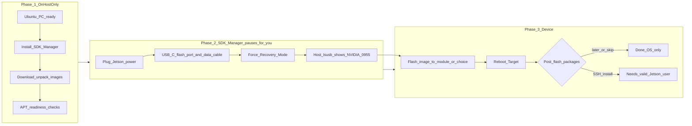

# Start here — flash Jetson AGX Orin (first-time friendly)

Use this page if you want the **timeline** of a real NVIDIA SDK Manager install: what happens first on the Ubuntu PC, and **when** you actually connect power and USB to the Jetson.

Older deep dives remain linked at the bottom; this file is meant to replace “open five tabs and guess the order.”

When you drive this workflow with Cursor / VS Code assistants / uploaded chat corpora, start from **[AGENTS.md](../AGENTS.md)** (policy) plus **[Agent + LLM usage notes](meta/agent-and-llm-usage.md)** so models **read Markdown here before hallucinating NVIDIA forum hearsay.**

---

## Flowchart — what happens in order



**Plain-language takeaway**

1. Large downloads and host checks typically run **before** the Jetson needs to sit in Recovery mode.
2. When SDK Manager tells you to, you connect **regulated DC power**, the **correct USB-C data port**, and enter **Force Recovery** so `lsusb` shows an NVIDIA (`0955:…`) device.
3. After the flash succeeds, SDK Manager may offer to push extra packages to the Jetson over SSH—you need a **real Linux user** on the device for that phase (often created by **Runtime OEM** onboarding or baked in with **Pre-Config**—see FAQ).

---

## 0 · Physical kit checklist (save this before Phase 2)

These items cause pain when skipped:

| Item | Guidance |
|------|----------|
| **Power** | Use the **recommended DC barrel supply** / official bundle. USB bus power alone is insufficient for flashing AGX kits. Keep the brick plugged into a dependable outlet. |
| **USB cable** | Short, USB **3.x**-rated, **charging+data**. Avoid docks and suspect long cables—they are statistically the #1 “flash failed” phantom bug. |
| **USB-C port choice** | Use the upstream **device/debug** Type-C labeled for flashing—not every Type-C cage on the chassis negotiates flashing. Prefer the NVIDIA devkit schematic (same side as FORCE REC). |
| **Cooling intake** | Do not bury the heatsink fan during soak tests after boot. |

If you populate **NVMe** on the Developer Kit tray and SDK Manager presents a choice of boot media, flashing **straight to NVMe now** avoids a painful migration later—especially useful for ROS bags, caches, Docker images, and roomy rootfs.

---

## 1 · Prep the Ubuntu flashing PC (still no Jetson required)

Assume **Ubuntu 22.04 LTS amd64**.

### Confirm networking

```bash
nmcli device status
```

Wi-Fi interfaces show `wifi` + `connected` when attached to an SSID. Quick reachability sanity check:

```bash
ping -c 3 ubuntu.com || ping -c 3 8.8.8.8
```

### Optional — graphical browser (`chromium`)

Only relevant on machines with a desktop session:

```bash
echo "$XDG_CURRENT_DESKTOP"
```

If that prints nothing you may be on a minimal server ISO—skip GUI packages.

Otherwise try Apt first:

```bash
sudo apt update
sudo apt install -y chromium-browser
```

Ubuntu may ship **`chromium`** as a Snap transitional package depending on archives; fallback:

```bash
sudo snap install chromium
```

Launch:

```bash
chromium-browser 2>/dev/null || chromium
```

Developer login for SDK Manager is browser-driven—Chrome/Chromium/Electron wrappers all work.

### Optional — SSH into the flashing PC from elsewhere

Install service:

```bash
sudo apt update
sudo apt install -y openssh-server
sudo systemctl enable --now ssh
sudo systemctl --no-pager status ssh
```

Show addresses:

```bash
hostname -I
```

Firewall hole if enabled:

```bash
sudo ufw allow OpenSSH || sudo ufw allow ssh
```

### Disk layout safety net

Reserve large downloads away from cramped `/home` partitions:

```bash
mkdir -p /opt/nvidia/sdkm_downloads /opt/nvidia/nvidia_sdk
sudo chown -R "$USER:$USER" /opt/nvidia/sdkm_downloads /opt/nvidia/nvidia_sdk
df -h / /home
```

If SDK Manager rejects `/home` free space—even after cleanup—explicitly clamp cache paths with `--download-folder` and `--target-image-folder`.

---

## 2 · Launch SDK Manager (downloads / Phase 1)

Example CLI launcher (adapt JetPack `--version`, add `--show-all-versions` until you memorize release strings):

```bash
sdkmanager --cli --action install --login-type devzone \
  --product Jetson \
  --target-os Linux \
  --version 6.2.2 \
  --show-all-versions \
  --target JETSON_AGX_ORIN_TARGETS \
  --flash \
  --download-folder /opt/nvidia/sdkm_downloads \
  --target-image-folder /opt/nvidia/nvidia_sdk \
  --license accept
```

Interactive GUI flow is analogous: pick **Jetson → AGX Orin**, enable **Jetson Linux flash**, optionally host-side CUDA payloads if you intend to cross-compile on this PC (`--host` CLI flag selects those blobs).

Expect **downloads** (`BSP`, `rootfs`, tools, CUDA stacks if elected). Latency is normal.

### Why “nothing asks for Recovery yet?”

Healthy—SDK Manager grabs multi-gig artifacts first. Seeing only host activity is ordinary **Phase 1** behavior.

---

## 3 · When SDK Manager stalls for hardware (Phase 2)

Only once prompted:

1. Regulated power on Jetson stable.
2. USB-C flashing port + quality cable inserted into host USB port (rear motherboard ports outperform front panels).
3. Enter **Force Recovery** per AGX quick-start (hold FORCE REC → tap POWER → release timings per current NVIDIA bulletin).
4. Verify from host (`0955:` vendor id snippet is common):

```bash
lsusb | grep -E '0955|NVIDIA'
```

If no device dances between `0955` PIDs (`7020`, `7023`, etc.) try another cable/host USB header.

---

## 4 · Choices that behaved well in-field

| Prompt | Recommendation for first flashes |
|--------|-------------------------------------|
| **Automatic vs Manual** | Choose **Manual** when board is virgin or tooling previously failed automatic SSH probing. Automatic assumes you already possess valid Jetson SSH credentials—often false hour zero. |
| **IPv4 vs IPv6** | Default **IPv4** unless IPv6-native lab routing. Gadget-style `192.168.55.*` prefixes appear regularly. |
| **Runtime vs Pre-Config OEM** | **Runtime**: walk through onboarding on local display. **Pre-Config**: avoids multi-hour systemd OEM stalls—but you must consciously type the planned username/password. |
| **Post-flash “Install extras” vs Skip** | **Skip** if you only validate OS baseline; rerun later once credentials stabilize. |

If anything contradicts NVIDIA’s freshest dialog text, defer to NVIDIA’s UI—but log deviations in [bring-up-journey.md](jetson/bring-up-journey.md).

---

## 5 · After flash succeeds

Golden log lines resemble:

`*** The target generic has been flashed successfully. ***`

Perform first boot onboarding if **Runtime**.

Then revisit SDK Manager selections if you deliberately skipped payloads—read summaries literally (look for **`Flash Jetson Linux: Skipped`** as a contradiction with intent).

Smoke checks → [jetson/post-flash-checklist.md](jetson/post-flash-checklist.md).

---

## When things spiral

| Situation | Go to |
|-----------|-------|
| Symptomatic errors with quick fixes | [jetson/troubleshooting.md](jetson/troubleshooting.md) |
| Narrative pacing (“already tried this twice”) | [jetson/bring-up-journey.md](jetson/bring-up-journey.md) |
| Decision cheat sheet bullets | [jetson/faq.md](jetson/faq.md) |
| Exhaustive scripted steps | [jetson/flash-runbook.md](jetson/flash-runbook.md) |
| Publication strategy (Git/wiki/Notion) | [meta/documentation-strategy.md](meta/documentation-strategy.md) |

---

## Maintainers tag

Bump [CHANGELOG](../CHANGELOG.md) whenever JetPack or SDK Manager changes rename UI strings materially.
